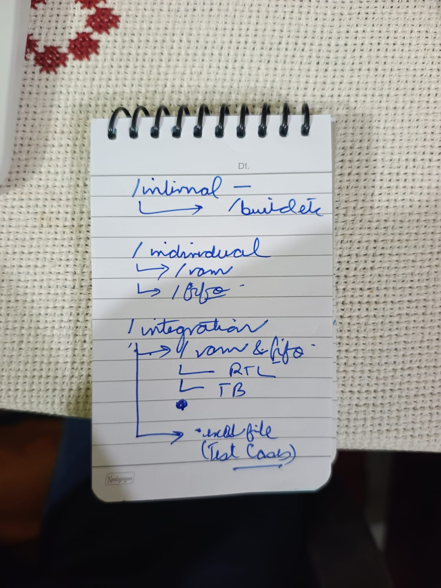

# RAM + FIFO Learning Workspace

This repository is organized as a progressive Verilog learning workspace: start with the smallest build artifacts, verify RAM and FIFO independently, then test the RAM-backed FIFO and its reusable SystemVerilog functional-coverage integration.

## Handwritten directory plan



The implemented structure follows this plan: build artifacts stay under `minimal`, standalone blocks stay under `individual`, and the connected RAM/FIFO design keeps its RTL and testbenches together under `integration`.

## Repository layout

```text
ramAndFifo/
|-- minimal/
|   `-- build/                         # Compiled simulation outputs
|-- individual/
|   |-- ram/                           # Standalone RAM RTL and testbench
|   `-- fifo/                          # Standalone internal-memory FIFO RTL and testbench
|-- integration/
|   |-- RAM_FIFO_Test_Cases.xlsx       # Verification matrix and run summary
|   |-- functional_coverage/           # One collector reused by both FIFOs
|   `-- ram_and_fifo/
|       |-- rtl/                       # RAM-backed FIFO RTL and wrapper
|       `-- tb/                        # Integration testbenches
|-- docs/                              # Notes and reference material
`-- README.md
```

`ram_and_fifo` uses an underscore instead of `ram&fifo` so the path is portable and does not require shell escaping.

## Active files

### Individual blocks

- RAM: `individual/ram/sync_ram.v`
- RAM practice draft: `individual/ram/practice.v`
- RAM testbench: `individual/ram/tb_sync_ram.v`
- FIFO with internal memory: `individual/fifo/sync_fifo.v`
- FIFO testbench: `individual/fifo/tb_sync_fifo.v`

### RAM + FIFO integration

- RAM-backed FIFO: `integration/ram_and_fifo/rtl/sync_fifo_ram.v`
- Simpler naming wrapper: `integration/ram_and_fifo/rtl/syncFifo.v`
- Primary integration testbench: `integration/ram_and_fifo/tb/tb_sync_fifo_ram.v`
- Wrapper testbench: `integration/ram_and_fifo/tb/tb_syncFifo.v`
- Historical asynchronous benches: `integration/ram_and_fifo/tb/archive/async/`
- Preserved earlier integration bench: `integration/ram_and_fifo/tb/archive/sync/tb_sync_fifo_ram_legacy.v`
- Preserved malformed draft, excluded from builds: `integration/ram_and_fifo/rtl/archive/sync_fifo_ram_draft.v`

### Functional-coverage integration

- [Coverage discussion and commands](integration/functional_coverage/README.md)
- [Shared FIFO collector](integration/functional_coverage/fifo_functional_coverage.sv)
- [Internal-memory FIFO coverage wrapper](integration/functional_coverage/tb_internal_fifo_coverage.sv)
- [RAM-backed FIFO coverage wrapper](integration/functional_coverage/tb_ram_backed_fifo_coverage.sv)
- [Questa coverage report script](integration/functional_coverage/run.do)

## Recommended learning path

1. Read and simulate `individual/ram/sync_ram.v`.
2. Read and simulate `individual/fifo/sync_fifo.v`.
3. Study how `integration/ram_and_fifo/rtl/sync_fifo_ram.v` instantiates the standalone RAM.
4. Run the integrated testbench and compare the results with `integration/RAM_FIFO_Test_Cases.xlsx`.
5. Attach the shared collector through each wrapper and compare behavioral coverage between the internal-memory and RAM-backed FIFOs.

## Useful commands

Run these commands from the repository root.

```powershell
# Standalone RAM
iverilog -Wall -g2012 -s tb_sync_ram -o minimal/build/simv_ram_basic individual/ram/tb_sync_ram.v individual/ram/sync_ram.v
vvp minimal/build/simv_ram_basic

# Standalone FIFO
iverilog -Wall -g2012 -s tb_sync_fifo -o minimal/build/simv_fifo_basic individual/fifo/tb_sync_fifo.v individual/fifo/sync_fifo.v
vvp minimal/build/simv_fifo_basic

# RAM-backed FIFO integration
iverilog -Wall -g2012 -s tb_sync_fifo_ram -o minimal/build/simv_sync integration/ram_and_fifo/tb/tb_sync_fifo_ram.v integration/ram_and_fifo/rtl/sync_fifo_ram.v individual/ram/sync_ram.v
vvp minimal/build/simv_sync

# Simpler wrapper
iverilog -Wall -g2012 -s tb_syncFifo -o minimal/build/simv_sync_style integration/ram_and_fifo/tb/tb_syncFifo.v integration/ram_and_fifo/rtl/syncFifo.v integration/ram_and_fifo/rtl/sync_fifo_ram.v individual/ram/sync_ram.v
vvp minimal/build/simv_sync_style
```

The ordinary commands above remain compatible with Icarus Verilog. For real
SystemVerilog covergroup collection, use the Questa commands and limitations
documented in the [functional-coverage integration](integration/functional_coverage/README.md).
